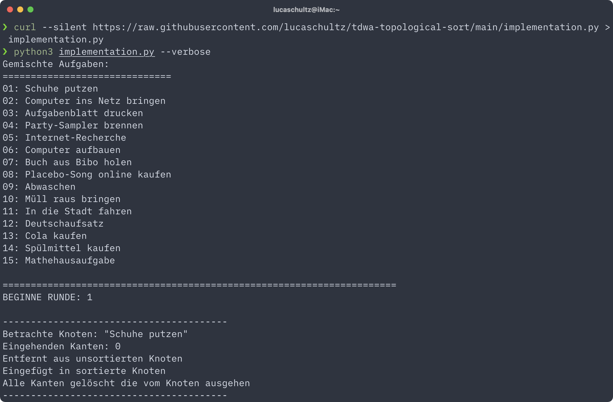

# Topologisches Sortieren

[![CC BY 4.0][cc-by-shield]][cc-by]

Dieses Repository enthält Unterlagen zum Vortrag über Topologisches Sortieren für das Modul [BA-INF 015 - Techniken des Wissenschaftlichen Arbeitens](https://basis.uni-bonn.de/qisserver/rds?state=verpublish&status=init&vmfile=no&publishid=192528&moduleCall=webInfo&publishConfFile=webInfo&publishSubDir=veranstaltung) an der Universität Bonn.

## Beispiel Skript



Eine naive Version [Kahns topologischen Sortieralgorithmus](https://dl.acm.org/doi/abs/10.1145/368996.369025) wurde in `implementation.py` implementiert. Der Algorithmus basiert auf der Beschreibung in der [vorgegebenen Primärquelle](https://algo.rwth-aachen.de/~algorithmus/algo8.php) des Vortrags.

Das Skript muss mit mindestens mit [Python 3.5](https://www.python.org/downloads/release/python-350/) ausgeführt werden, da es ausführliche [Type Hints](https://www.python.org/dev/peps/pep-0484/) enthält.

Um das Skript auszuführen kann entweder das Repository geklont werden:

```bash
git clone https://github.com/lucaschultz/tdwa-topological-sort.git
```

Oder das Skript einzeln (z.B. mit `curl`) runter geladen werden:

```bash
curl --silent https://raw.githubusercontent.com/lucaschultz/tdwa-topological-sort/main/implementation.py > implementation.py
```

Danach kann es einfach von der Kommandozeile ausgeführt werden:

```
$ python3 implementation.py
Gemischte Aufgaben:
==============================
01: Computer aufbauen
02: Buch aus Bibo holen
·
·
·

Sortierte Aufgaben:
==============================
01: Computer aufbauen
02: In die Stadt fahren
·
·
·
```

Mit der `-v` oder `--verbose` Option gibt die Sortierfunktion bei jedem Schritt an welcher Knoten betrachtet und wie damit verfahren wird:

```
$ python3 implementation.py --verbose
·
·
·

========================================
BEGINNE RUNDE: 1

----------------------------------------
Betrachte Knoten: "Schuhe putzen"
Eingehenden Kanten: 0
Entfernt aus unsortierten Knoten
Eingefügt in sortierte Knoten
Alle Kanten gelöscht die vom Knoten ausgehen
----------------------------------------
Betrachte Knoten: "Placebo-Song online kaufen"
Eingehenden Kanten: 1
Keine weitere Aktion möglich
----------------------------------------
·
·
·

Sortierte Aufgaben:
==============================
01: Schuhe putzen
02: Computer aufbauen
·
·
·
```

Mehr Informationenn zur Implementierung des Skriptes im [Foliensatz](https://github.com/lucaschultz/tdwa-topological-sort/blob/main/TdwA_SS2021_Studienleistung_1_Luca_Schultz_3130274.pdf).

## Lizenz

This work is licensed under a [Creative Commons Attribution 4.0 International License][cc-by].

[![CC BY 4.0][cc-by-image]][cc-by]

[cc-by]: http://creativecommons.org/licenses/by/4.0/
[cc-by-image]: https://i.creativecommons.org/l/by/4.0/88x31.png
[cc-by-shield]: https://img.shields.io/badge/License-CC%20BY%204.0-lightgrey.svg
