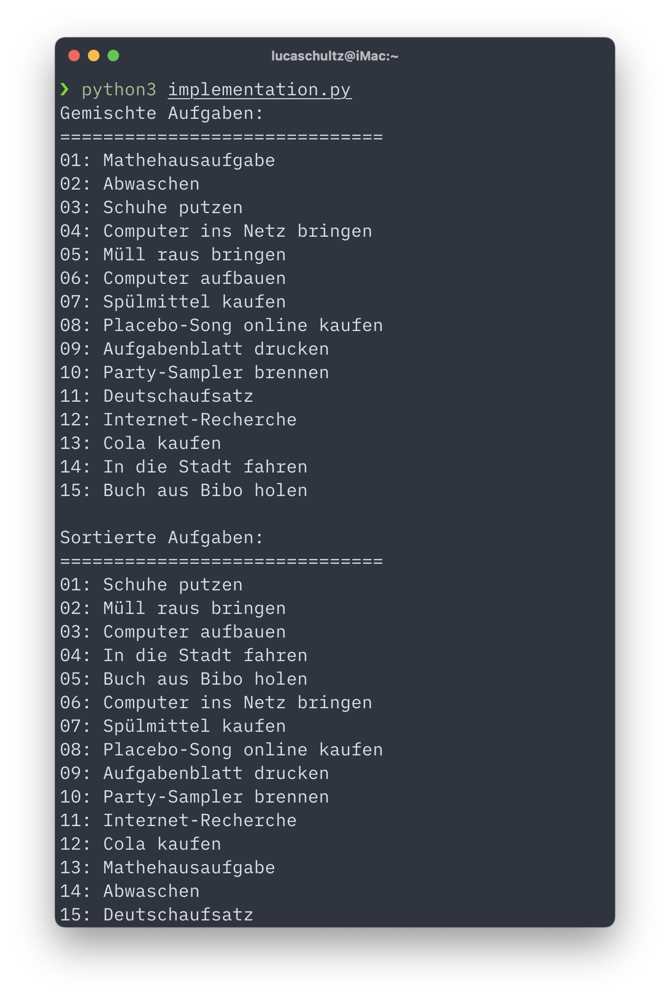
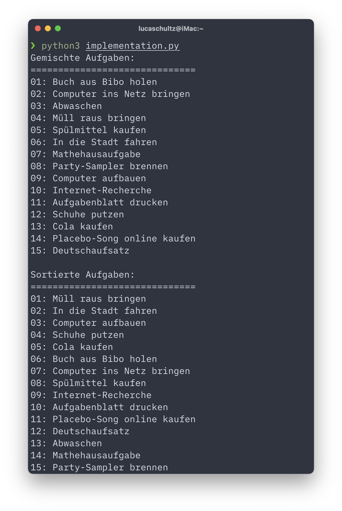
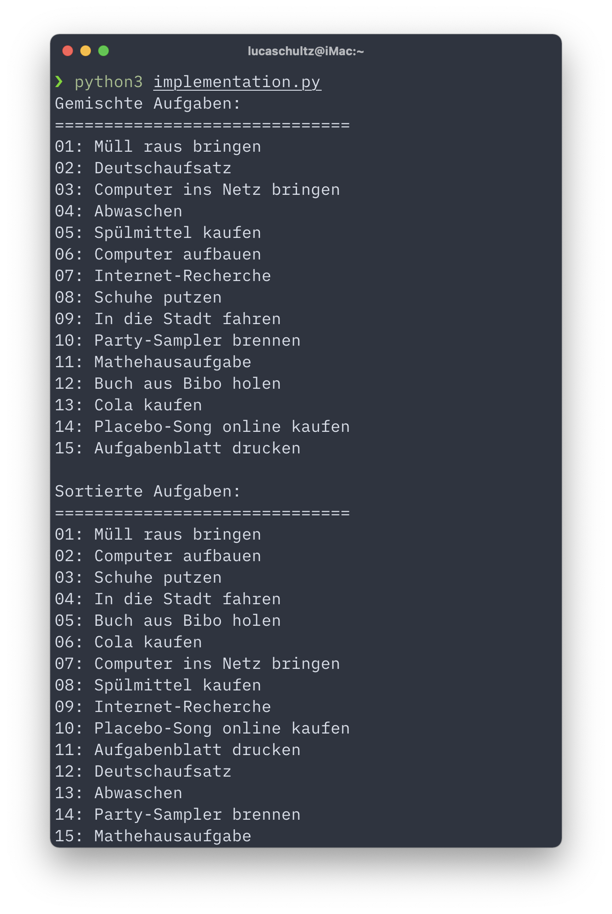

theme: Simple Merriweather
footer: Topologisches Sortieren  ·  Luca Schultz
slidenumbers: true
build-lists: false

<!-- Folien Generiert mit Deckset: https://www.deckset.com -->

<br/>

# Topologisches Sortieren

#### Präsentationsaufgabe für TdWA

**Luca Schultz**
Rheinische Friedrich-Wilhelms-Universität Bonn
13.07.2021

---

#### Inhalt

1. Anschauliche Beschreibung des Problems
2. Formale Definition des Problems
3. Intuitive Beschreibung von Kahns Sortieralgorithmus
4. Implementierung in Python
5. Zusammenfassung
6. Quellen

---

#### Sortieren von gerichteten Graphen


- Ordnung von Knoten eines **gerichteten**, **azyklischen** Graphs
- Für jede gerichtete Kante von Knoten $$a$$ zu Knoten $$f$$ ist Knoten $$a$$ vor Knoten $$f$$ in der Ordnung.
- Zum Beispiel anwendbar:
    + Belegung von Lehrveranstaltungen
    + Softwareentwicklung
    + Task Scheduling

<a name="erster-graph"/>

---

#### Mathematik: Starke Ordnung

- Eine Ordung $$\prec_R$$ einer Menge $$M$$ ist eine **binäre Relation** $$\prec_R \subseteq M \times M$$
- Eine binäre Relation ist eine **starke Ordnung** genau dann, wenn sie folgende Bedingungen erfüllt: 
    1. Irreflexivität: $$\forall a \in M: \neg(a \prec_R a)$$
    2. Transitivität: $$\forall a, b, c \in M: a \prec_R b \land b \prec_R c \implies a \prec_R c$$
    3. Asymmetrisch: $$\forall a, b \in M: a \prec_R b \implies \neg(b \prec_R a)$$

^**Irreflexivität**: Element steht nicht in Relation zu sich selbst
**Transitivität**: Relation von *a* zu *b* und *b* zu *c* impliziert Relation von *a* zu *c*
**Asymmetrisch**: Wenn zwei Elemente in Relation stehen ist die Umkehrung **nicht** enthalten

---

#### Mathematik: Beispiel für eine starke Ordnung

Beim Graph $$G = (M, \prec_R)$$ auf der [vorherigen Folie](#erster-graph) ist die Menge der Kanten $$\prec_R \subseteq M \times M$$ eine **starke Ordung** auf die Menge der Knoten $$M$$:

- Menge der Knoten: $$M = \{a, b, c, d, e, f \}$$
- Menge der Kanten (Relation): $$\prec_R = \{(a, b), (a, f), (b, c), (c, e), (c, d), (d, f), (d, e) \}$$

---

#### Mathematik: Starke Totalordnung

- Eine starke Ordnung $$\prec_T$$ heißt **starke Totalordnung** genau dann, wenn gilt:
    + $$\prec_T$$ ist **linear**: $$\forall a, b \in M: a = b \underline{\lor} a \prec_T b \underline{\lor} b \prec_T a$$
- **Sortieralgorithmus:** Finde zu einer starken Ordnung $$\prec_R \subseteq M \times M$$ auf $$M$$ eine starke Totalordnung $$\prec_T$$, so dass gilt $$\prec_R \subseteq \prec_T$$

^ Linearität: Zwei Elemente *a*, *b* sind entweder gleich, oder es ist *a Relation b* oder *b Relation a*

---

#### Kahns Sortieralgorithmus

Jeder gerichtete, azyklische Graph hat *mindestens* einen Knoten ohne eingehende Kanten (Eingangsgrad $$i = 0$$)

1. Entferne alle Knoten mit $$i = 0$$ und alle Kanten, die von ihnen ausgehen
2. Füge die entfernten Knoten in die geordneten Knoten ein
3. Es entstehen neue ungeordnete Knoten mit $$i=0$$
4. Wiederhole bis es keine ungeordneten Knoten mehr gibt

^ Arthur B. Kahn, 1962 im Artikel **Topological sorting of large networks** in Communications of the ACM *(Association for Computing Machinery)*

---

#### Datensatz aus der Primärquelle


---

#### Sortierter Datensatz aus der Primärquelle


---

#### Python: Kahns Sortieralgorithmus

```python
def topologisch_sortieren(unsortierte_knoten: KnotenListe, kanten: KantenListe) -> KnotenListe:
    '''Gib topologisch sortierte KnotenListe aus'''
    sortierte_knoten: KnotenListe = []
    while unsortierte_knoten:
        zyklisch: bool = True
        for knoten in unsortierte_knoten.copy():
            if not kanten_auf(knoten, kanten):
                unsortierte_knoten.remove(knoten)
                sortierte_knoten.append(knoten)
                kanten = ohne_kanten_von(knoten, kanten)
                zyklisch = False
        if zyklisch:
            raise ValueError("Knotenliste enthält zyklische Abhängigkeiten")
    return sortierte_knoten
```

^ Naive Variante in 7 Zeilen Code

---

#### Python: Vorbereitung


[.code-highlight: all]
[.code-highlight: 1-3]
[.code-highlight: 4-6]
[.code-highlight: 7-10]
[.code-highlight: all]

```python
from random import shuffle
from typing import List, Tuple

# Grundtypen
Knoten = str
Kante = Tuple[str, str]

# Containertypen
KnotenListe = List[Knoten]
KantenListe = List[Kante]
```


---

#### Python: Knoten in `KnotenListe`

```python
# Alle Aufgaben aus der Primärquelle
unsortierte_aufgaben: KnotenListe = [
    "Cola kaufen",
    "Müll raus bringen",
    "Schuhe putzen",
    "Computer aufbauen",
    "Mathehausaufgabe",
    "In die Stadt fahren",
    "Computer ins Netz bringen",
    "Spülmittel kaufen",
    "Aufgabenblatt drucken",
    "Buch aus Bibo holen",
    "Abwaschen",
    "Internet-Recherche",
    "Deutschaufsatz",
    "Placebo-Song online kaufen",
    "Party-Sampler brennen",
]
```

---

#### Python: Kanten in `KantenListe`

```python
# Alle Abhängigkeiten der Aufgaben aus der Primärquelle
abhängigkeiten: KantenListe = [
    ("In die Stadt fahren", "Spülmittel kaufen"),
    ("Spülmittel kaufen", "Abwaschen"),
    ("In die Stadt fahren", "Cola kaufen"),
    ("In die Stadt fahren", "Buch aus Bibo holen"),
    ("Buch aus Bibo holen", "Deutschaufsatz"),
    ("Computer aufbauen", "Computer ins Netz bringen"),
    ("Computer ins Netz bringen", "Internet-Recherche"),
    ("Internet-Recherche", "Deutschaufsatz"),
    ("Computer ins Netz bringen", "Aufgabenblatt drucken"),
    ("Aufgabenblatt drucken", "Mathehausaufgabe"),
    ("Computer ins Netz bringen", "Placebo-Song online kaufen"),
    ("Placebo-Song online kaufen", "Party-Sampler brennen"),
]
```

---

#### Python: Hilfsfunktionen

[.code-highlight: all]
[.code-highlight: 1]
[.code-highlight: 3-4]
[.code-highlight: 6]
[.code-highlight: 8-9]
[.code-highlight: all]

```python
def kanten_auf(knoten: Knoten, kanten: KantenListe) -> KantenListe:
    '''Gib KantenListe aus mit allen Kanten die auf `knoten` führen'''
    return [kante for kante in kanten if kante[1] == knoten]


def ohne_kanten_von(knoten: Knoten, kanten: KantenListe) -> KantenListe:
    '''Gib KantenListe aus mit allen Kanten die nicht von `knoten` ausgehen'''
    return [kante for kante in kanten if not kante[0] == knoten]
```

---

#### Python: Die Sortierfunktion

[.code-highlight: all]
[.code-highlight: 1]
[.code-highlight: 3]
[.code-highlight: 4-13]
[.code-highlight: 4]
[.code-highlight: 5]
[.code-highlight: 6-11]
[.code-highlight: 6]
[.code-highlight: 7-11]
[.code-highlight: 7]
[.code-highlight: 8]
[.code-highlight: 9]
[.code-highlight: 10]
[.code-highlight: 11]
[.code-highlight: 12-13]
[.code-highlight: 14]
[.code-highlight: all]

```python
def topologisch_sortieren(unsortierte_knoten: KnotenListe, kanten: KantenListe) -> KnotenListe:
    '''Gib topologisch sortierte KnotenListe aus'''
    sortierte_knoten: KnotenListe = []
    while unsortierte_knoten:
        zyklisch: bool = True
        for knoten in unsortierte_knoten.copy():
            if not kanten_auf(knoten, kanten):
                unsortierte_knoten.remove(knoten)
                sortierte_knoten.append(knoten)
                kanten = ohne_kanten_von(knoten, kanten)
                zyklisch = False
        if zyklisch:
            raise ValueError("Knotenliste enthält zyklische Abhängigkeiten")
    return sortierte_knoten
```

---

#### Python: Aufrufen der Sortierfunktion

[.code-highlight: all]
[.code-highlight: 1-2]
[.code-highlight: 4-7]
[.code-highlight: 9-10]
[.code-highlight: 12-15]
[.code-highlight: all]

```python
# Shuffle nodes
shuffle(unsorted_tasks)

# print shuffled nodes
print("Gemischte Aufgaben:\n" + "=" * 30)
for n, node in enumerate(unsorted_tasks):
    print('{:02d}: {}'.format(n+1, node))

# Sort nodes
sorted_tasks: KnotenListe = topologisch_sortieren(unsortierte_aufgaben, abhängigkeiten)

# Print sorted nodes
print("\nSortierte Aufgaben:\n" + "=" * 30)
for n, node in enumerate(sorted_tasks):
    print('{:02d}: {}'.format(n+1, node))
```

---

#### Python: Ergebnis

  

---

#### Python: Selber Probieren


- Sämtliche Vortragsunterlagen und Skript auf GitHub: <https://github.com/lucaschultz/tdwa-topological-sort>
- Skript muss mindestens mit [Python 3.5](https://www.python.org/downloads/release/python-350/) ausgeführt werden
- *Verbose* Option `-v`, gibt bei jedem Schritt an welcher Knoten betrachtet und wie damit verfahren wird

---

### Zusammenfassung

- Sortieren von Mengen mit starker Ordnungsrelation
    + Darstellbar durch gerichtete, azyklische Graphen
- Laufzeit von Kahns Sortieralgorithmus $$\Theta(|M| + |\prec_T|)$$
- Anwendung auf Probleme, bei denen keine *vollständige* Ordnung vorhanden ist 

---

[.autoscale: true]

#### Quellen

- Höpfner, H. (2006). Topologisches Sortieren - Mit welcher Aufgabe meiner ToDo-Liste fange ich an? Retrieved June 12, 2021 from <https://algo.rwth-aachen.de/~algorithmus/Algorithmen/algo8/algo08.pdf>
- Cormen, T. H., Leiserson, C. E., Rivest, R. L., & Clifford, S. (2009). Introduction to Algorithms (2 ed.). MIT Press and McGraw-Hill. Retrieved from <http://books.google.de/books?id=i-bUBQAAQBAJ&hl=&source=gbs_api_>
- Demaine, E. (2011). Lecture 14: Depth-First Search (DFS), Topological Sort. Retrieved 13. Jun, 2021 from <https://ocw.mit.edu/courses/electrical-engineering-and-computer-science/6-006-introduction-to-algorithms-fall-2011/lecture-videos/lecture-14-depth-first-search-dfs-topological-sort/>
- Kahn, A. B. (1962). Topological sorting of large networks. Communications of the ACM, 5(11), 558-562. doi:10.1145/368996.369025
- Petersen, W. (2013). Ordnungsrelationen – 4. Foliensatz. Retrieved 13. Jun, 2021 from <https://user.phil.hhu.de/~petersen/WiSe1314_mathGrundl/Petersen_math_grundl_4.pdf>
